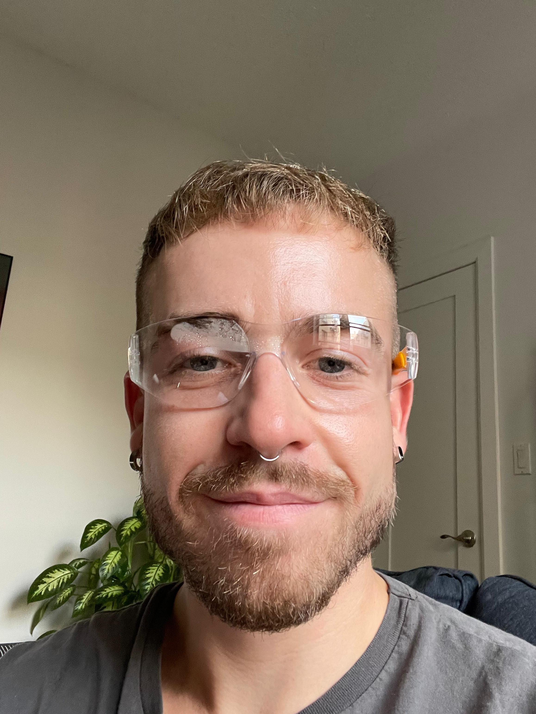

# Team Fish — Creative Motion Control Course Site

## Team Members

  
  <h3>Fiona Irving-Beck</h3>
  
<em>MS/PhD, Media Arts and Technology</em>

  
Fiona Irving-Beck is a multimedia artist with research experience in applied mathematics. They are particularly interested in using interactive media to explore the boundary between the digital and physical worlds. Fiona holds BA degrees in mathematics and studio art from Scripps College.
  
  Within Creative Motion Control, Fiona is most excited to gain hands-on experience working with CNC machines and to explore alternative modes of interaction.

  
  <h3>Eric M Rennie</h3>
  
<em>M.S., Media Arts and Technology</em>

  
<em>University of California, Santa Barbara</em>

  
Eric Rennie is a creative technologist with a background that spans media, including video and audio production, physical computing, and computer science. He joined MAT with an interest in visualizing data in unconventional ways, especially by using information from the physical world to shape these visualizations and explore new modes of human-computer interaction. His goal is to eventually collaborate with architects and engineers to design large-scale immersive environments-public, corporate, and cultural spaces that move beyond four walls and respond to environmental or contextual data, transforming the media elements that surround the observer.
  
  As a student in the Creative Motion Control course, Eric is most excited to explore embedded systems through machine modification, as well as physical computing by using sensors to drive CNC machines. He’s also interested in studying human-computer interaction to improve how people experience and use these tools.

<!-- Copy the block above to add more team members -->

## Projects

<table>
  <thead>
    <tr>
      <th>Project</th>
      <th>Description</th>
    </tr>
  </thead>
  <tbody>
    <tr>
      <td><a href="projects/project1/docs/index.md">Project 1</a></td>
      <td>A CNC embosser that uses water level data from Santa Barbara to construct a Perlin noise field</td>
    </tr>
    <tr>
      <td><a href="projects/project2/docs/proposal.md">Project 2 Proposal</a></td>
      <td>A CNC machine which aims to offer the craft of embossing accuracy and symmetry that hand embossing can lack</td>
    </tr>
    <tr>
      <td><a href="projects/project2/docs/midpointReview.md">Project 2 Mid-Point</a></td>
      <td>Mid-Point Review of our CNC embosser</td>
    </tr>
    <tr>
      <td><a href="projects/project2/docs/PeerReview.md">Project 2 Peer Review</a></td>
      <td>Project 2 Peer Review of our CNC embosser</td>
    </tr>
  </tbody>
</table>
