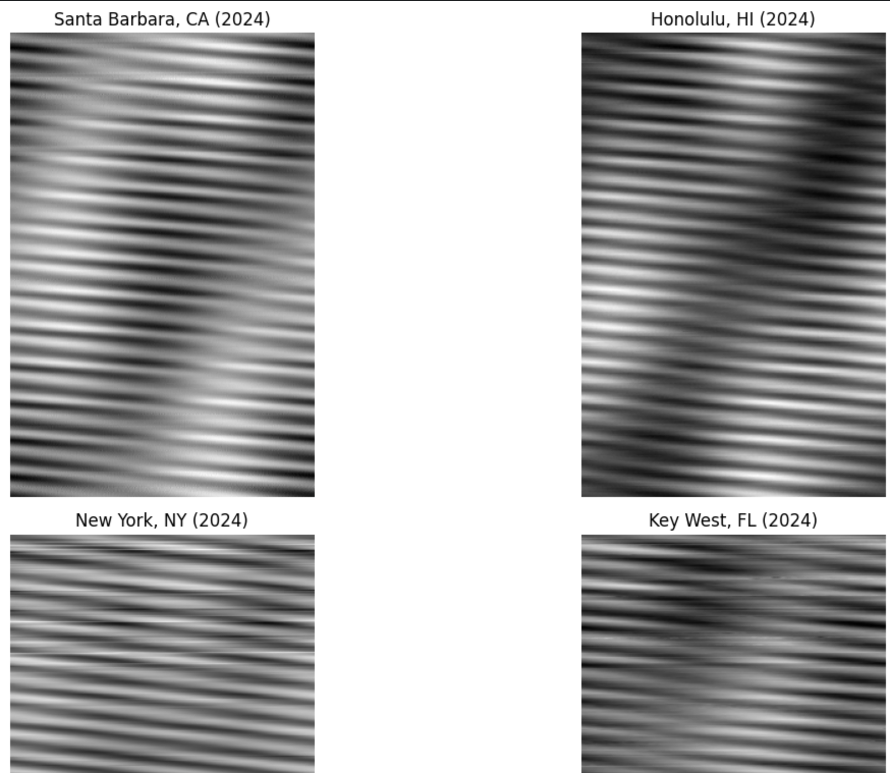
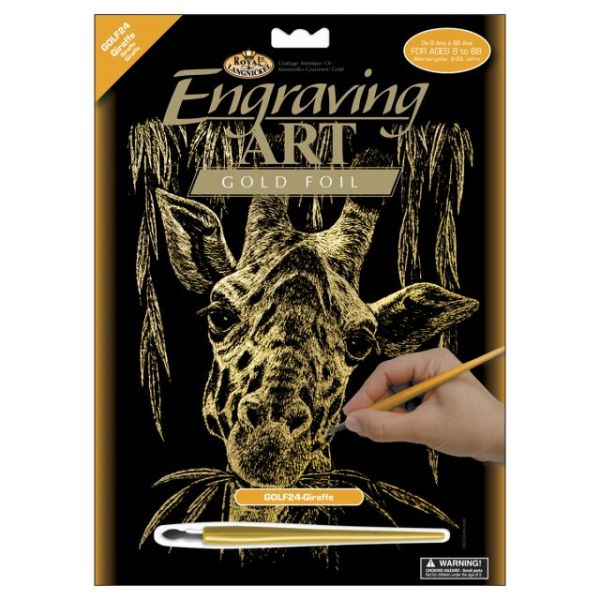
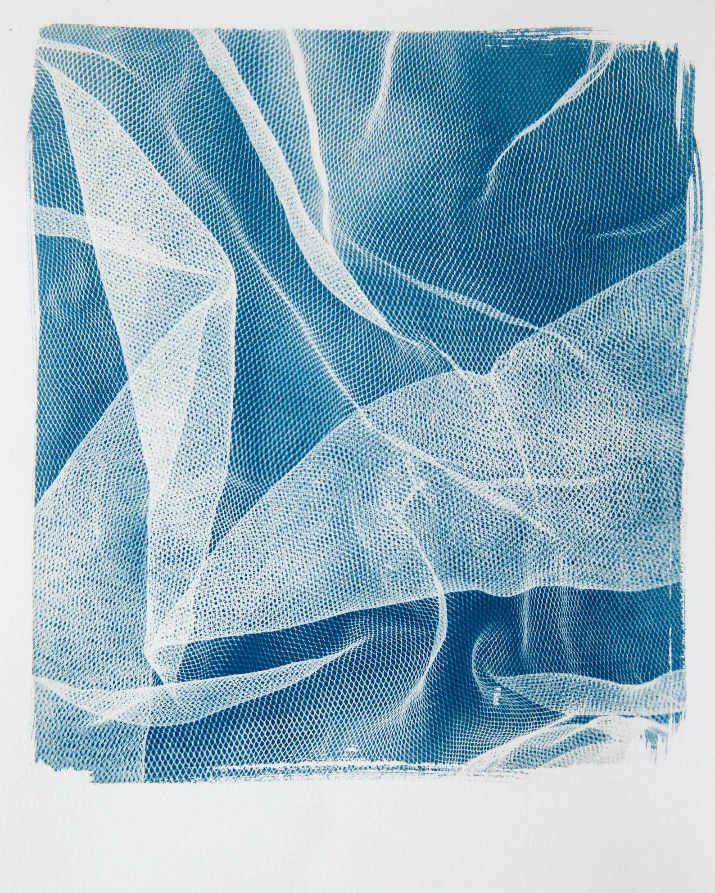

# Project 1: [Tidal Etchings]

## Concept
We envision using tide data, specifically water level data, to drive the plotter, sourcing this information from publicly available ocean data. Applying a Fast Fourier Transform (FFT) to the changing of tides generates the following striking visuals:

Source: Eric Rennie, MAT 201A Final - [Wave Analysis](https://colab.research.google.com/drive/1wMDJQnCfFCxfJfh0BmFAmVRZFt0H-DMc?usp=sharing#scrollTo=px44jtXfb3IZ)

[The National Oceanic and Atmospheric Administration (NOAA) Data Retrieval API](https://api.tidesandcurrents.noaa.gov/api/prod/) offers us the ability to fetch water level data at various intervals, including in 1 minute or 6 minute intervals, hourly, daily, and monthly. We imagine translating this data into lines which curve and bend through the influence of ocean data, turning the sea into the artist. Our approach is to increase the amount of noise/distortion the higher the tide is. Not only does this data change dependent on location-it's also influenced by the location's weather, position of the moon, and the approximate 50-minute tide shift that happens each day. We envision creating a series of images to show these variations. 

Our aesthetic inspirations include more traditional examples of plotter art that capture three-dimensional-esque textures in a beautiful way. We are especially inspired by [Jazer's Piece](https://www.instagram.com/reel/DDQtjU5pk2v/?utm_source=ig_web_copy_link&igsh=MzRlODBiNWFlZA%3D%3D).

We are interested in exploring negative space and subtractive rather than additive texture. For this reason, we are drawn to etching or engraving rather than ink/paint. On a secondary level, this echoes the ability of tides to erode and shape the coastline, so there's also a conceptual draw to this technique. This might involve using the following, which is nostalgic from both our childhoods: 

Furthermore, as a reach goal, we are interested in then retranslating or "photographing" our plotter generated design using cyanotype process. This would involve creating an image negative transparency as an overlay by scanning the image and inverting in some photo editing software. The developing stage would take place at the coast, where the data used to generate the image was sourced. This would effectively reintroduce it back into its natural environment. From here, it would be possible to further augment the chemical reaction with additives (shifting the color from traditional Prussian blue), potentially also from the coastal site of data collection. 

Here is an example of a cyanotype image of cloth: 

## Design

(Explain your design process. What choices did you make and why?)

We were very excited about embossing, and this dictated the form our hardware took. As detailed above in our proposal, we were particularly drawn to subtractive mediums, on both a conceptual and aesthetic level. 

For the plotter path output, we were compelled to work with a Perlin noise flowfield. We were struggling to decide how best to map our tide data water level to each generated line. We wanted cohesion to exist across the outputted image, but since we would be applying a noise/amplification effect to each individual one, this would not result in such cohesion. Instead, we decided to map water level to a parameter within a dynamic vector field. This way, sequential lines would share similar trajectories given their temporal proximity and flow. 

To create a dynamic flowfield, we worked from a wonderful YouTube code tutorial and example by Patt Vira, video link and original p5 sketch available at: https://www.youtube.com/watch?v=KOgRn2Brcdo, https://editor.p5js.org/pattvira/sketches/R5sp8PVXl. Going into the code and uncommenting the vector angles, it's possible to see how they dynamically swing at each time step. So, we decided to link the "increment" between each vector angle -- corresponding to how similar they are to one another -- to our value for water level. Thus, more dynamic paths are created during higher water level times, but each line is related to the one before and after it. 

Due to plotter constraints, we had to change the sketch further. Our modifications are as follows:
1. The plotter can only draw one line at a time, corresponding to a single particle. We limited it to one particle

2. Plotter cannot teleport, but particles can (falling off the canvas spawns them on the opposite side). To combat this, we delete a particle once it reaches the edge of the canvas. 

Additionally, for the sake of prototyping, we made the design choice to just work with a set amount of data, within a 24 hour bound. We believe that extending the project with live data is relatively straightforward, given that our flowfield updates every six minutes (API call for NOAA).  

## Implementation

(Describe how you implemented your project using the StepDance library.)

Our primary challenge was navigating the flow of data. Eric already had fetched NOAA data within p5 and we were working from a prior-existing Perlin noise flowfield p5 sketch framework. For this reason, it made the most sense to us to work to generate flowfield particle lines within p5.js, and then send this location information to StepDance. 

To accomplish this, we used the p5_ui Arduino sketch as provided within the StepDance Axidraw examples. We also referenced Emilie Yu's sketch example for controlling a machine through a p5 interface in StepDance, available at: https://editor.p5js.org/em-yu/sketches/oLFB8F0hn. The serial connection between p5 and Arduino relies on the p5.serialcontrol desktop application. 

### Hardware Setup

(Describe your hardware configuration.)

Our hardware setup does not drastically differ from the original Axidraw configuration. The primary challenge was to apply the correct amount of tension to the embosser tip, versus the traditional gravity-ruled pen down design. Here, observe our rubber-band assisted embossing tip setup.

*INSERT IMAGE*

This effectively provides enough additional pressure to dent the metal surface. We tried several pen heights, finding that too much pressure causes a rough line, and too little just scratches the surface. Here, we can see a line created with excess force (circled in red) versus one with appropriate tension. 

*INSERT IMAGE*

We tried multiple different configurations for the embossed metal sheet. More specifically, we were uncertain if a hard or soft surface would provide the best embossing base. We found that a soft surface provided the clearest lines. So, our final setup included a soft styrofoam pad under the metal surface. We can see this underlying, soft surface in the following image: 


Another adjustment we made -- given the additional pressure required for embossing, our first servo motor burned out so we had to install a more powerful one. Here, see the new motor:

*INSERT IMAGE*

### Code Overview

The majority of our code exists in a p5.js sketch. The full code is available within the code folder of this Project 1 Github. 

(Highlight key parts of your code and explain your approach:)

The first step in our workflow is establishig serial connection and fetching tide data.
```cpp
// Paste and explain relevant code snippets here

```

The particle class contains several essential functions. We define x, y positions, and determine how each particle moves. 
```cpp
// Paste and explain relevant code snippets here

```

One key aspect of our code was the sequence order. Here, we programmed a particle to toggle on or off at various times. 
```cpp
// Paste and explain relevant code snippets here

```
Another primary feature was sending the XY coordinates via serial monitor. This occurs within our draw loop, which then calls particle related functions
```cpp
// Paste and explain relevant code snippets here

```

## Results

Here is our plotter in action. The video is as follows:

<iframe width="560" height="315" src="https://www.youtube.com/embed/VIDEO_ID" frameborder="0" allowfullscreen></iframe>
* NOTE: need to take video tmw morning *

*Replace the iframe above with your actual video URL, or use a local video:*

<!--
<video width="560" controls>
  <source src="assets/demo-video.mp4" type="video/mp4">
</video>
-->

## Reflection

What did you learn? What would you do differently?

One area for potential expansion is within the serial connection between p5 and StepDance. The p5.serialconnection desktop application was incredibly buggy, and we had to reconnect many, many times within our process of testing. 
