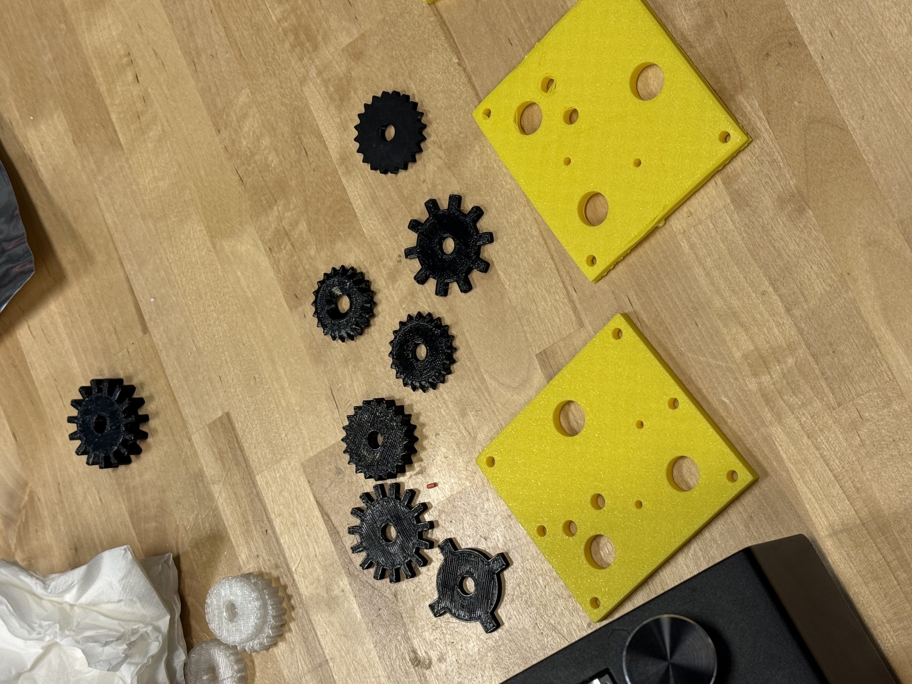
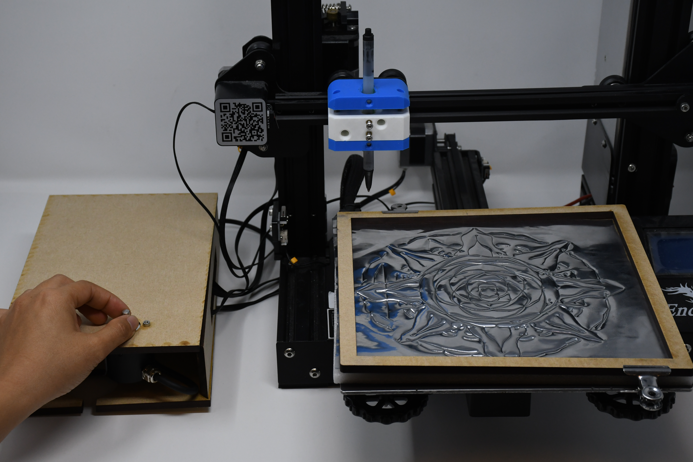
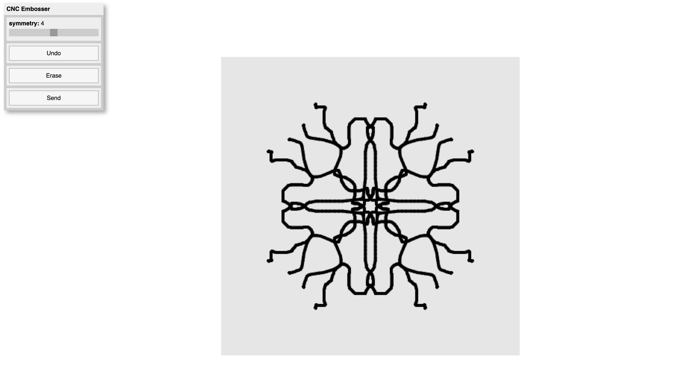
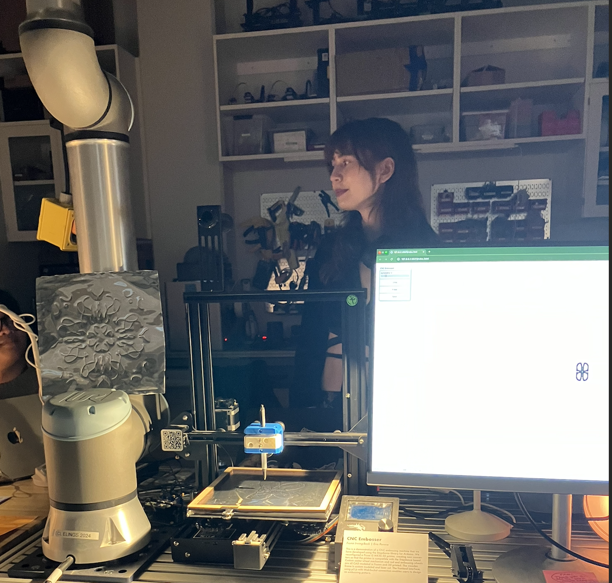
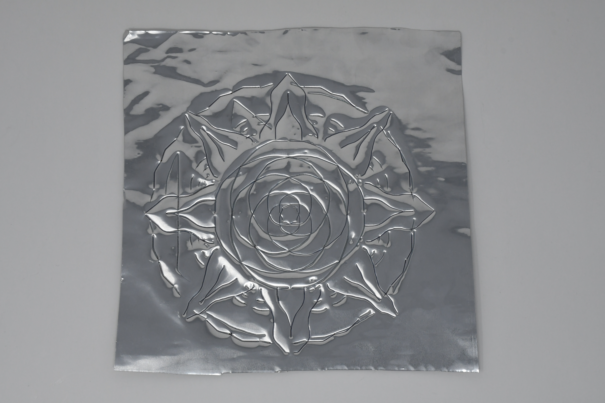
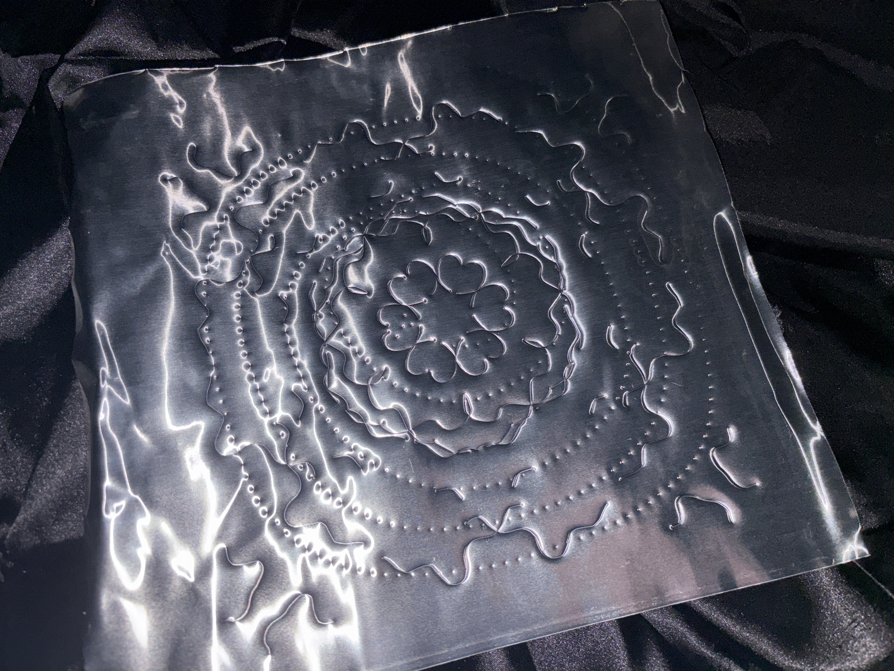
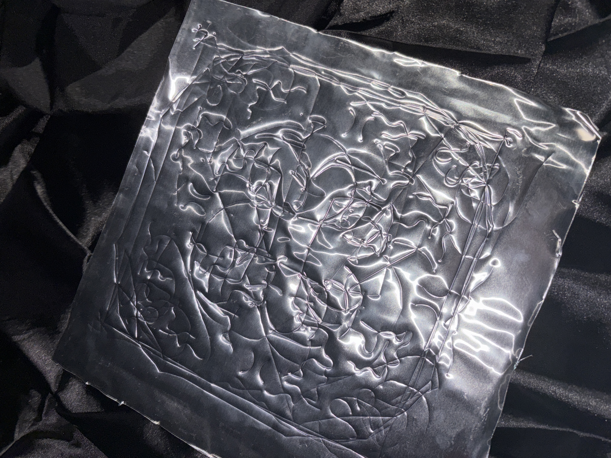
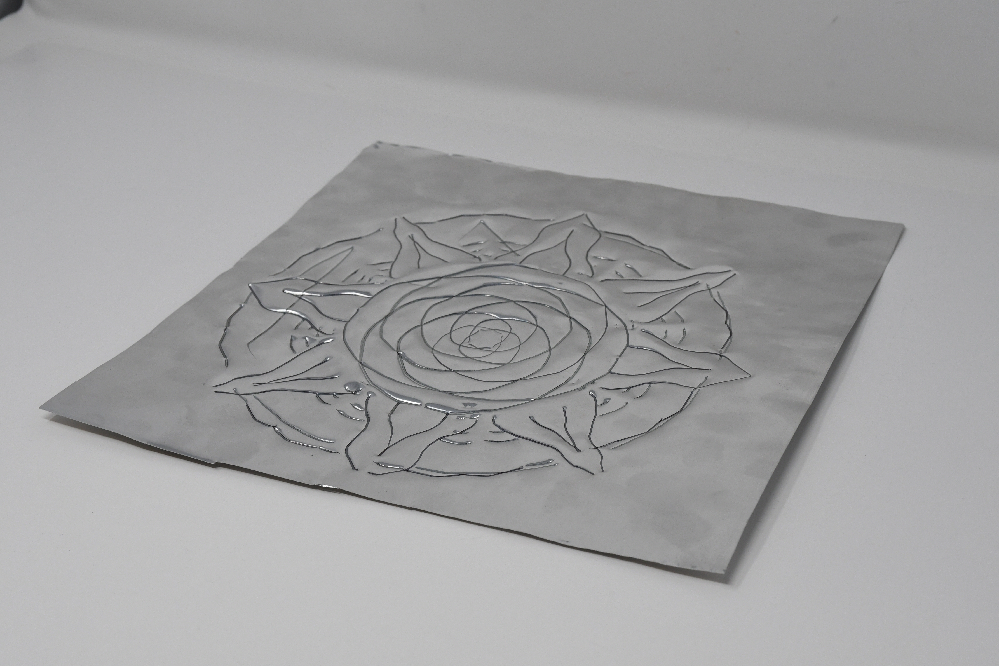

# Development Documentation:

### CAD Work:
We began our development process by  hand embossing with a stylus and testing various 3D printed stamps on our metal surface. We continued our CAD stage of design, creating a series of rolling wheels. 

 

Then, we began to design a caster mechanism in Fusion in order to house a ball bearing and allow our custom wheels to easily pivot along the surface. This design went through several iterations, including increasing the stability of screw connections and adding an upper lip to keep the ball bearing in place. Additionally, we created a rod that the caster mechanism screws into, which is then mounted to the printer.

<iframe width="560" height="315" src="https://youtu.be/embed/EgRxJ07jZb4" title="YouTube video player" frameborder="0" allow="accelerometer; autoplay; clipboard-write; encrypted-media; gyroscope; picture-in-picture; web-share" referrerpolicy="strict-origin-when-cross-origin" allowfullscreen></iframe>

### Hardware:
Simultaneously, we reconfigured the Ender 3D printer for our purposes. We ultimately opted to use a ballpoint pen in lieu of our embossying styluses. The rolling mechanism of the pen and lubricating pen ink allows for much smoother lines. We also used a [pre-modeled toolhead](https://github.com/AndrewSink/pltr_toolhead) that includes a spring mechanism which compensates for both the amount of force required for embossing and any surface irregularities encountered throughout the process.  

Here, we see a video of the functioning embosser being used with a ballpoint pen. 

<iframe width="560" height="315" src="https://youtu.be/embed/Ifee8Bci4Ek" title="YouTube video player" frameborder="0" allow="accelerometer; autoplay; clipboard-write; encrypted-media; gyroscope; picture-in-picture; web-share" referrerpolicy="strict-origin-when-cross-origin" allowfullscreen></iframe>

To better secure our foam surface and metal sheet, we designed and laser cut a wooden frame, which is then clamped on the perimeter of the Ender platform. Furthermore, we designed and laser cut a wooden box, assembled to mask our Stepdance board and potentiometer. See both frame and box pictured here. 

We calibrated the four corners of our platform to ensure surface regularity. We also rolled out each sheet of metal prior to clamping it in place for a smooth, flat surface. 

### UI and Frontend:
The UI was developed in p5.js, using a custom Websocket connection that sends data to the Arduino sketch. Here, the user can draw a series of lines, aided by the optional symmetry feature. Erase and Undo buttons are implemented as well. Once a design is finalized, the user presses "Send" to begin the embossing process. The points are sent in batches, spaced as necessary so as to not overwhelm the board. The user may also make adjustments to the Z-axis position to ensure the pressure level of embossing is correct with the potentiometer control. 

# End of Year Show:
This machine was shown as part of the MAT End of Year Show. Observe the setup here. 

Note that a separate monitor and mouse were used to allow attendees to create their own embossed designs. The collaborative artifacts that resulted are shown below. Participants greatly enjoyed using the device and were eager to learn about the mechanisms that drove it. It was rewarding to interact with these viewers!  

# Resulting Artifacts:
We can start by looking at the first test artifact developed from our final hardware configuration and working UI. 
<iframe width="560" height="315" src="https://youtu.be/embed/5WrpiEKs30Q" title="YouTube video player" frameborder="0" allow="accelerometer; autoplay; clipboard-write; encrypted-media; gyroscope; picture-in-picture; web-share" referrerpolicy="strict-origin-when-cross-origin" allowfullscreen></iframe>

Here, observe an artifact resulting solely from the caster mechanism using the custom dotted line wheel in naturalistic and non symmetric pathways. This is pictured alongside the wheel itself. 

We can also use the dotted wheel in conjunction with the normal pen tip. 

Next we have at an artifact from the End of the Year Show, formed from many collaborative lines.

Finally, here is a more refined piece that reflects our increased familiarity with the machine. 

# Final Reflection:
Moving from a more unconventional, artistic approach where water level data influences the amount of Perlin noise applied to a particle that moves across a canvas, we decided to create a machine that aids and improves the craft of embossing. Two areas of standard embossing that we noticed could be improved through the collaboration of a computer are symmetry and a pre-planned path. In standard hand-embossing, it is difficult to perfectly draw the same line or pattern on several symmetrical areas of the embossing surface. It is also impossible to undo any marks made on the surface. In order to solve both of these problems, we implemented a user interface (UI) that offers users the ability to divide the canvas into equal parts determined by the symmetry slider value, and automatically apply a drawing or design to every slice through a single drawing action on the canvas. We also included an undo button which erases one stroke at a time starting from the most recent, an erase button to begin anew, and a send button to transmit the finalized drawing to the CNC machine to begin embossing. 

Beyond the UI, we used CAD to create our own embossing wheel mechanism, commonly used in embossing to create repeatable patterns on a drawing surface. We tested a variety of patterns and selected our favorites, and created a caster-based mechanism that can be rolled along the drawing surface through a pre-planned path from the UI. Additionally, we incorporated a spring-loaded mechanism that supports the embossing pen and wheels during operation, compensating for both the amount of force required for embossing and any surface irregularities encountered throughout the process. Lastly, we attached an encoder to the Stepdance board which controls z-axis height and the force applied to the embossing surface. Users can adjust the z-axis when surfaces become uneven, or if they desire more shallow or deeper indentation into the material. 

Our process was extremely involved and we pushed ourselves to complete a meaningful working prototype. In future iterations, a custom-built ballpoint embossing stylus may be preferable to a standard ballpoint pen in order to improve the visual quality of the machine itself. Additionally, we would like to revisit the embossing wheel mechanism. Due to the current caster-based implementation, fine details are often lost, as the wheel performs best when following large curves or straight lines. One potential improvement is to mount a servo motor to the CNC machine’s end effector, enabling more precise control over the embossing wheel’s orientation. By adjusting the wheel’s rotation based on the angle and slope of the toolpath generated by the UI, the system could better capture intricate details and produce more accurate embossing results. Further, we postponed the implementation of a library of preset patterns users could select and place directly on the UI canvas due to time constraints. We would like to revisit this feature in future iterations. Finally, an area of interesting feedback we received is to offer users the ability to import digital works created in Adobe Illustrator into our software which can then be sent to the embossing machine. The space of further work and improvement is essentially limitless!

