# Project 2 Mid-Point Review:

## Material Experimentation & Embossing Patterns
In order to experiment with our aluminum medium, we designed and printed flat stamps whose patterns were inspired by common embossing wheel patterns. Embossing wheels are used to create repetitive patterns, in order to introduce a background, border, or additional contrast to the central embossed image. For inspiration, we are referencing <a href="https://esmericart.com/product-category/metal-embossing-texture-wheels-mercart/">this website</a>.

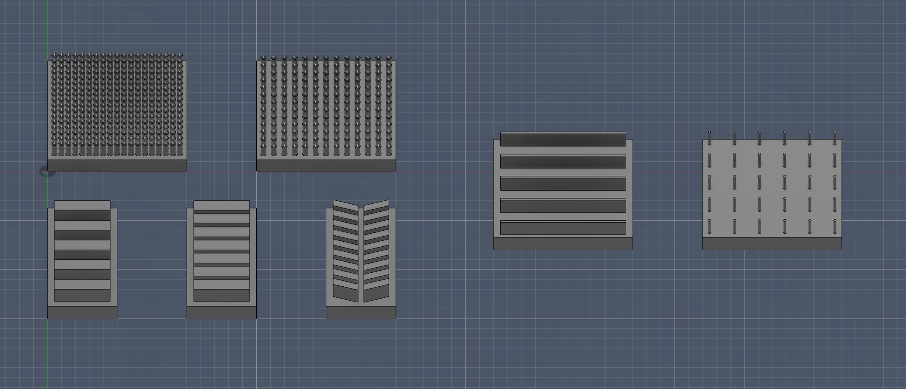
<figure>
  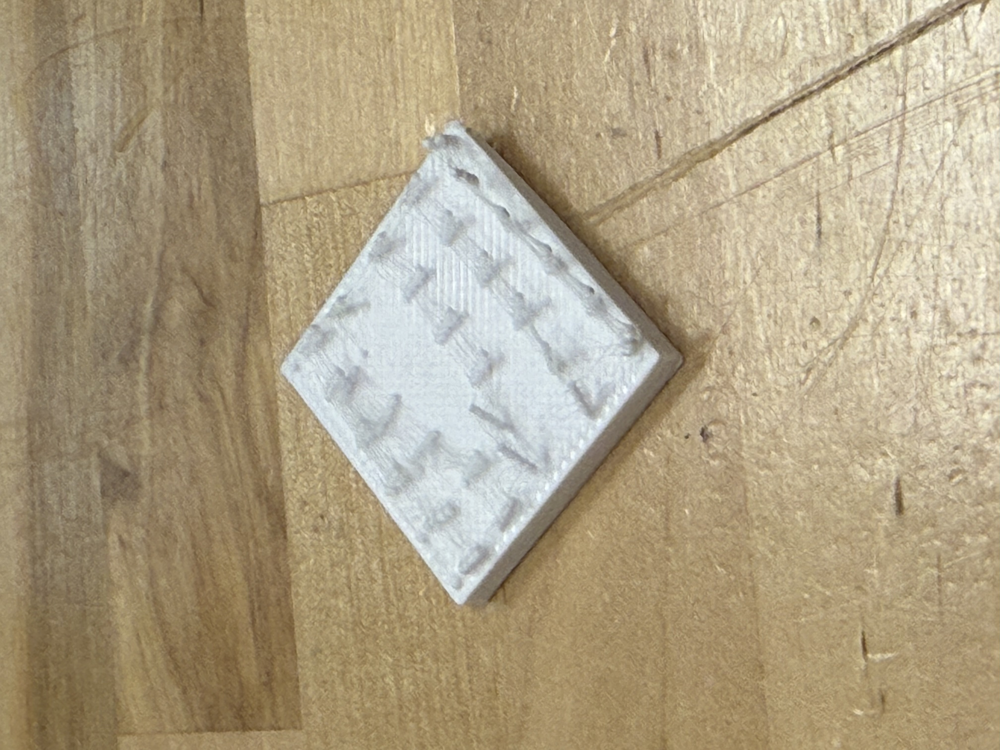
  <figcaption>The pegs on this stamp were too skinny and were crushed after one use.</figcaption>
</figure>

After experimenting with these stamps, we moved on to constructing embossing wheels, designing them in Fusion. We plan to make it easy for the user to swap out the embossing wheels and stylus, in order to enable additional design flexibility. Ideally, a magnetic link between the changeable tooltips and rod (also slightly nested/overlapped) would both provide a secure connection and easy customization. 

Here, this is an example of a wheel that creates a series of dashes.

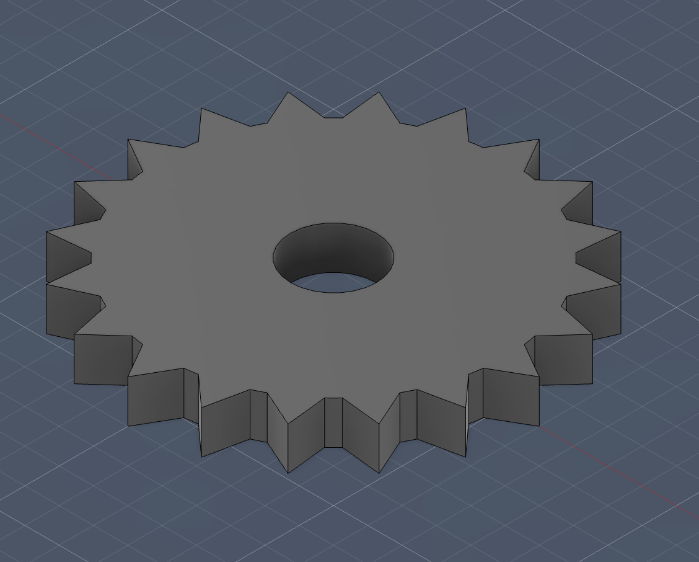

This wheel leaves a dotted path. 

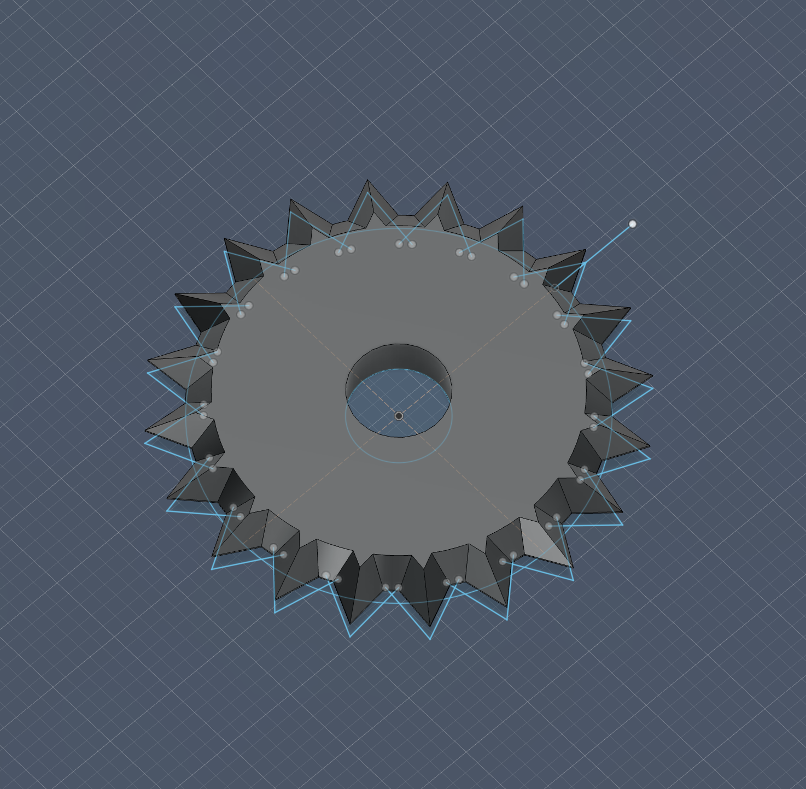

Finally, these wheels emboss the metal surface with a series of squares.

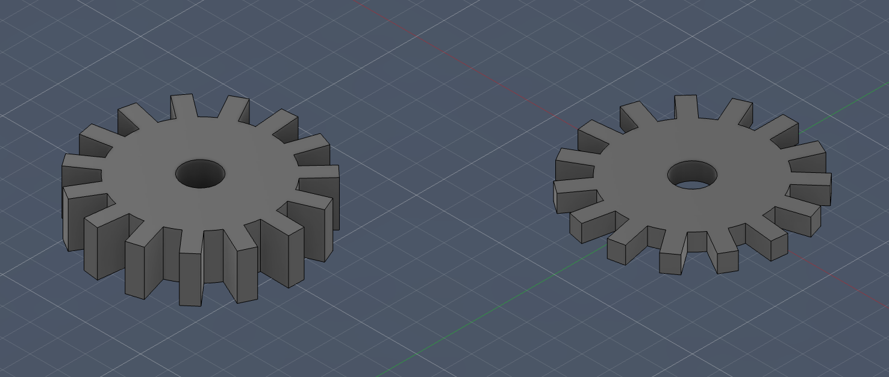

We also can observe our printer attachment plate, as well as our custom CAD modeled embossing wheels. 

 
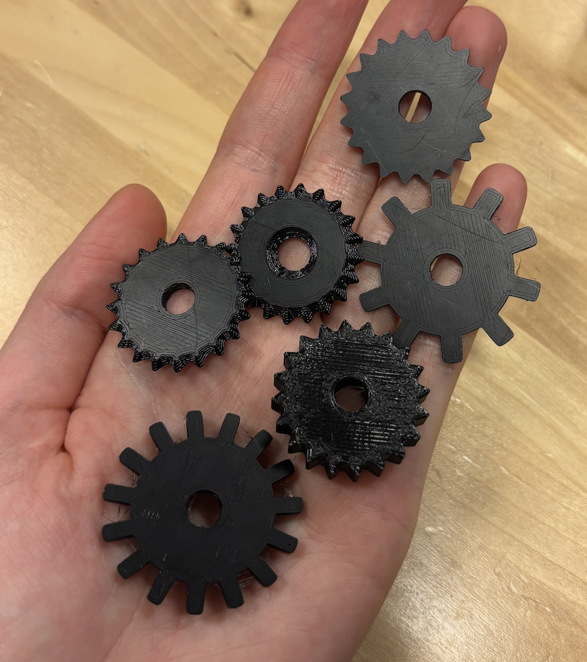

Here are some of our preliminary results, gathered by rolling each wheel along the surface of the metal sheet:
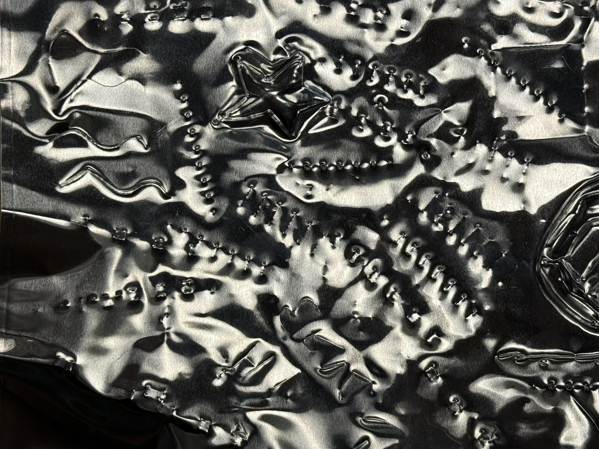

## 3D Printer Customization

We reconfigured a Prusa i3 MK3S 3D printer by disconecting the printer's x, y, and z-axes, and cutting the connectors off. We then crimped the wires and attached new connectors so that the printer is compatible with the Stepdance board. Here, we have several images documenting the reconfiguration process. 

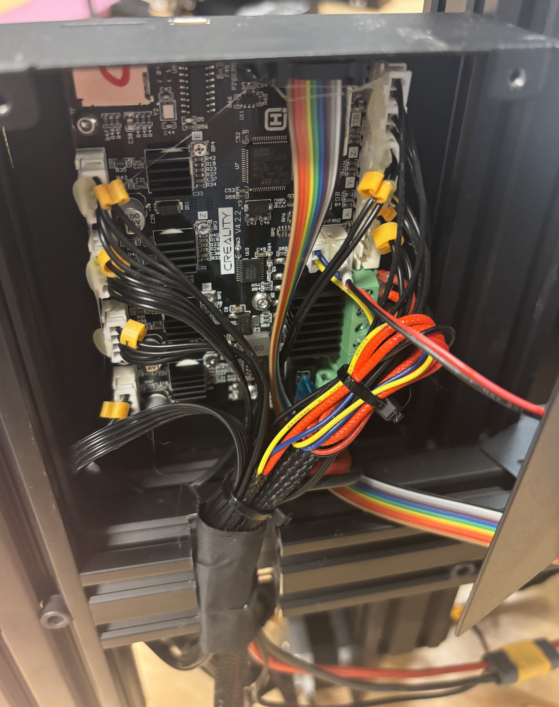
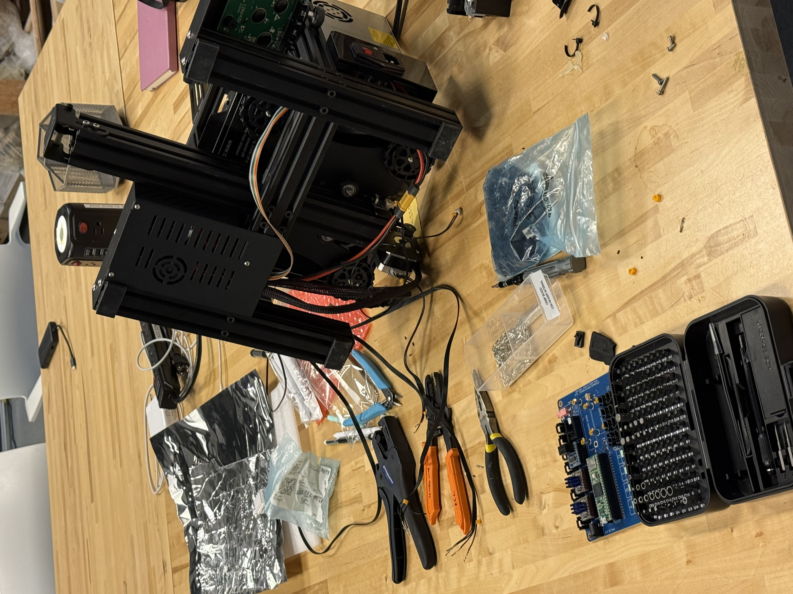
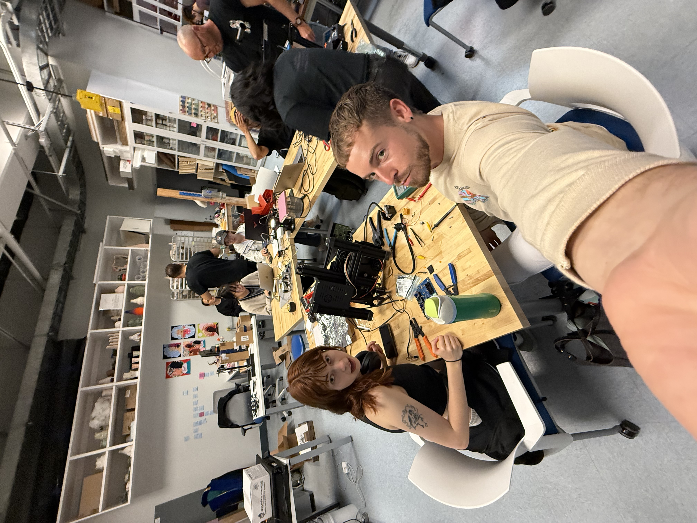

Once we reassembled the machine, we tested a basic embossing stylus. We affixed it with a print of <a href="https://github.com/AndrewSink/pltr_toolhead">this toolhead</a>, following the <a href="https://www.youtube.com/watch?v=c1Wo9KkZKNQ">ender installation guide</a>. This was relatively successful, though the spring didn't have quite enough room to freely move and required additional tolerance. 
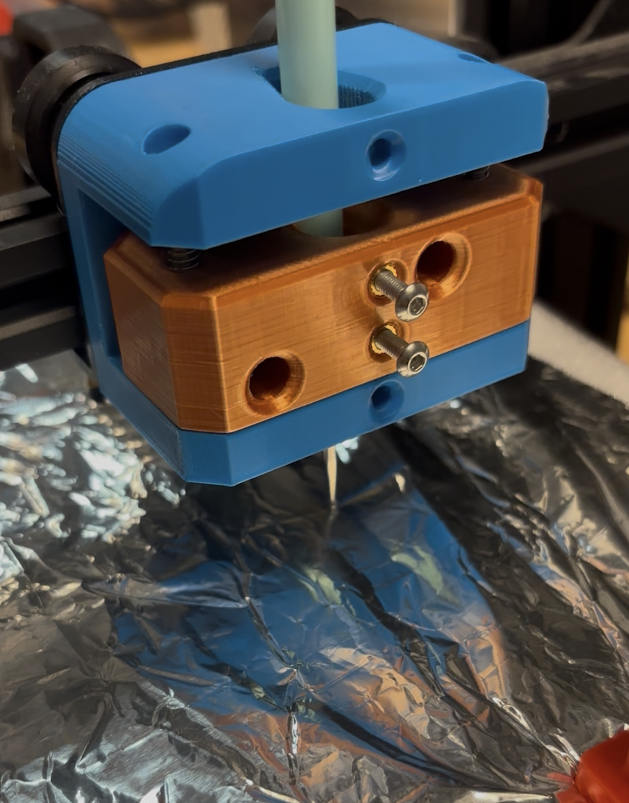

We also created a plate to attach to the printer which can be used to hold our tools, the physical print seen above along with the printed embossing wheels.

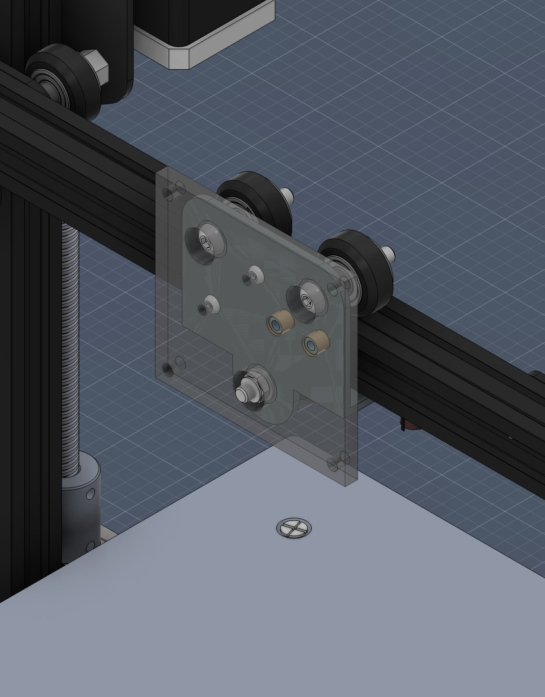

We considered creating an attachment to this plate that would house a servo motor, which would rotate the embossing tool. This would give the user the ability to use the embossing wheel in any 360-degree direction since the embossing wheel is constrained to forward and backward motion to effectively emboss. Here is a diagram of this proposed design:

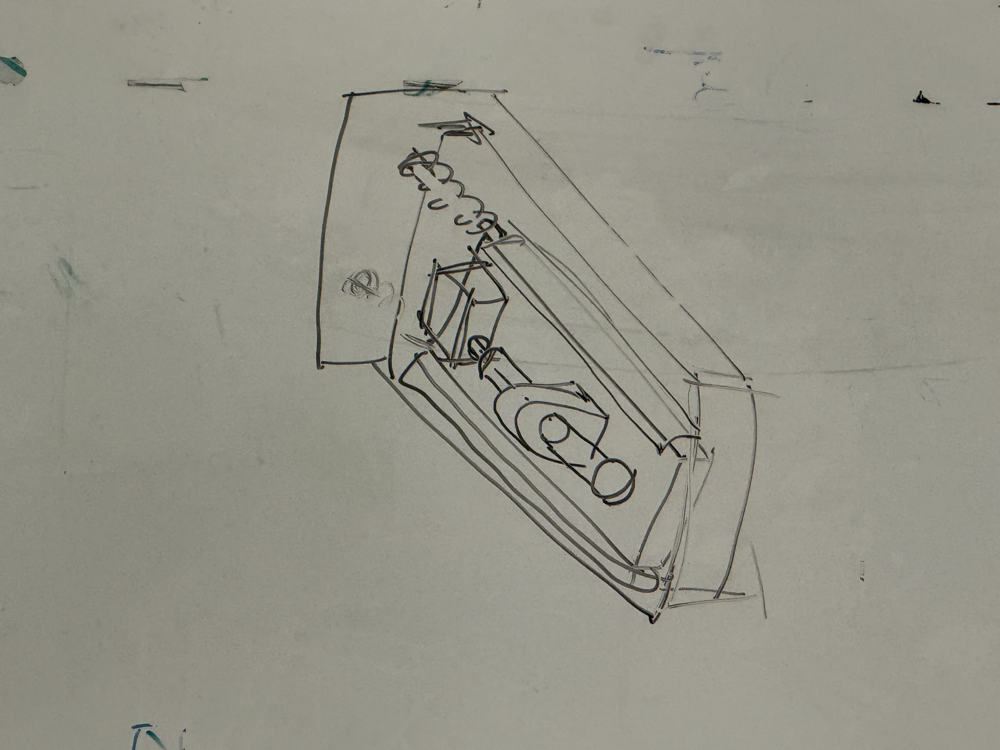

We have since abandoned this idea, and are instead working on a simpler caster attachment which will give the embossing wheel direction flexibility. This is modeled after shopping cart wheels. Here, observe our current CAD model that houses our embossing wheel, enabling for rotation with the ball bearing:

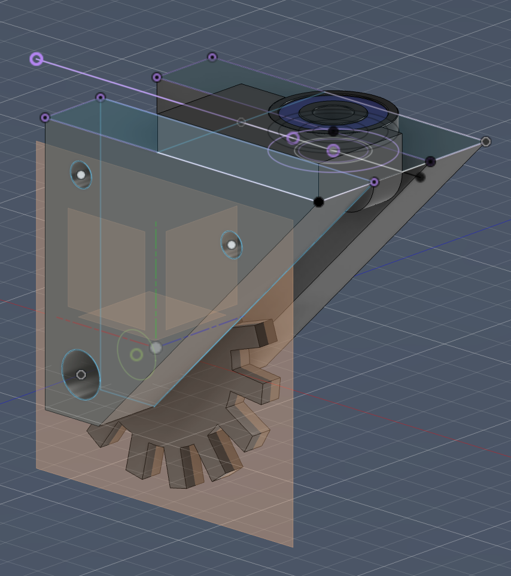

## Software Work
Simultaneously, we have been working within p5.js to create a custom interface for participants to design their own embossing patterns. Here, we are balancing flexibility with some imposed constraints, so that designs are best suited for the embossing mechanism. There is currently a free drawing ability, which is this reflected over axis for a symmetrical design. We are emphasizing the role of symmetry, such that our embossing machine has a very specific use case -- humans cannot easily replicate symmetrical designs by hand without the use of a stencil. Along with the UI design, we are deciding on how best to format the data so that a user can preview their design, and then opt to send it to the embosser once satisfied. 

## Next Steps
1. Software: As detailed above, we are continuing to work within p5.js to create a custom design interface.
2. Adjustments to caster mechanism: one of the connection points between the two sides of our modeled parts is in a weak area. We are instead moving this connection to the upper corner of the triangles, to ensure stability. We also are modifying the housing for the ball bearing, creating a slight lip on top that keeps it securely in place, and unable to slip out. 
3. Additional CAD components: we will model a rod that runs through the hole in our wheel and the triangular housing. We will also model the rest of the machine, allowing for a spring mechanism. 
4. Testing additional materials: once supplies arrive, we will continue to test differing foil types.
